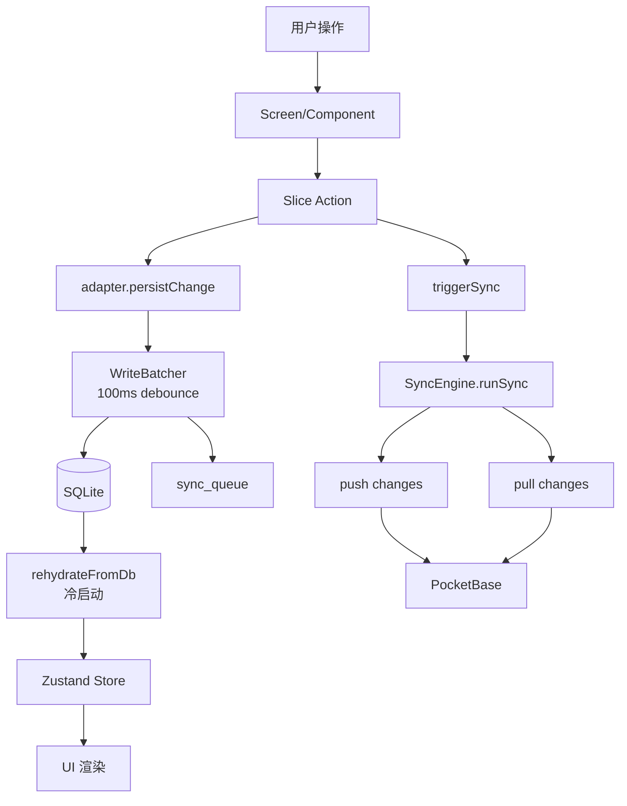

# 数据流架构

> 应用数据从用户操作到持久化、同步的完整流程。

## 概览



## 写入路径

```
用户操作
    │
    ▼
Slice Action (如 addHabit)
    │
    ├──────────────────────────────────────────┐
    │                                          │
    ▼                                          ▼
adapter.persistChange()                  triggerSync()
    │                                          │
    ▼                                          │
WriteBatcher.write()                           │
    │                                          │
    ├─ 100ms 后 flush()                        │
    │                                          │
    ▼                                          │
withDbLock {                                   │
  for (write of writes) {                      │
    BEGIN;                                     │
    UPDATE/INSERT SQLite;                      │
    INSERT sync_queue;                         │
    COMMIT;                                    │
  }                                            │
}                                              │
    │                                          │
    ▼                                          │
SQLite (WAL)                                   │
                                               │
                                               ▼
                                        SyncEngine.runSync()
                                               │
                                               ├─ drainQueue(50) × 10
                                               │
                                               ▼
                                        PocketBase REST
```

## 读取路径

```
冷启动
    │
    ▼
initApp()
    │
    ├─ Step 1: openDatabase
    ├─ Step 2: migrate (并行 with Token load)
    ├─ Step 3: flushWrites
    ├─ Step 4: rehydrateFromDb(CRITICAL)  ← 仅 3 实体
    │
    ▼
setInitDone(true) → 首屏渲染
    │
    ├─ [setTimeout 100ms]
    │   └─ rehydrateFromDb(DEFERRED)  ← 36 实体
    │
    ▼
完整 Store 就绪
```

## 同步协议

### Push（客户端 → 服务端）

```
1. drainQueue(50) → 取出 50 条 pending
2. POST /api/sync { changes: [...] }
3. PB hook 逐条应用：
   - 冲突检测（updatedAt 比较）
   - 应用变更（UPDATE/INSERT）
   - 返回 applied/rejected
4. 客户端更新 sync_queue 状态
```

### Pull（服务端 → 客户端）

```
1. GET /api/sync?lastSyncAt=xxx
2. PB hook 返回 updated_at > lastSyncAt 的记录
3. 客户端 merge 到 SQLite
4. 更新 lastSyncAt
```

## 性能优化

| 优化 | 效果 |
|------|------|
| 关键/延迟实体拆分 | 首屏 -300ms |
| 并行化迁移+Token | -100ms |
| FlashList 虚拟化 | 帧率 ↑ |
| 列表分页 | 内存 ↓ |
| 缺失索引 | 查询 -60% |

## 相关文档

- [同步协议详解](./sync-protocol.md)
- [状态管理架构](./state-management.md)
- [ADR-003: 为什么离线优先](../adr/003-why-offline-first.md)
