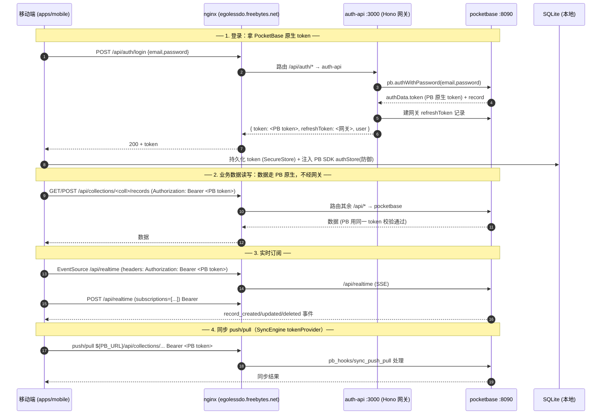

# 端到端鉴权与数据流向时序图（F1 §6-5）

> 关联：`docs/f1-backend-boundary-analysis.md`、`docs/auth-token-bridge.md`
> 域名统一经 `infra/nginx/nginx.conf` 按路径分流。

## 登录 + 数据访问主路径

## 关键不变量

1. **移动端只认一个域名**；nginx 按路径把 `/api/auth/*`、`/api/push`、`/api/plan/*`、`/api/monitoring`、`/api/setup` 引向网关，其余 `/api/*`、`/api/realtime`、`/_/` 引向 PocketBase。
2. **`/api/auth/login` 透传 PB 原生 token**（`auth/login.ts:97`），因此客户端持有的 `auth.token` 就是 PB 能校验的 token。
3. **所有鉴权路径一致携带该 Bearer token**（offlineAwareFetch / realtime / sync tokenProvider），不存在「集合公开」假设。

## 图例对应代码

| 步骤 | 代码位置 |
|------|----------|
| 登录取 token | `packages/core/src/auth.ts` → `infra/docker/api/src/auth/login.ts:70,97` |
| 数据带 Bearer | `apps/mobile/src/net/offlineAware.ts:32-40` |
| 实时带 Bearer | `apps/mobile/src/features/sync/RealtimeAgent.ts:132,225` |
| 同步 tokenProvider | `apps/mobile/src/features/sync/SyncEngine.ts:145,187` |
| 路由分流 | `infra/nginx/nginx.conf` |
| SDK 防御注入 | `packages/core/src/pocketbase.ts:setPocketbaseToken` → `apps/mobile/src/store/initApp.ts` |
